Exercise 1.1 - Utilizing DeTTECT to Visualize Visibility and Detection Capabilities
==========================================================

Objectives
==========

- Review the Functionality of DeTTECT
- Add Data Sources to DeTTECT
- Visualize Data Sources to the MITRE Framework 

Exercise Preparation
==========

Log into the Sec-555 VM

- Username: student

- Password: sec555

We will be looking at a company called LabMeINC. Our objective is to review their current data sources and determine if we have the appropriate visibility and detection capabilities for their organization. LabMeINC is like most organizations and has the following data sources currently being ingested into their Security Incident and Events Management(SIEM) system. 
* Windows Logs
* Endpoint Security Logs
* Linux Logs
* Network Device Logs 

To accomplish this review we will be utilizing a tool called DeTTECT which will allow us to map out the data sources that LabMeINC is collecting and determine what visibility they have. Let start by reviewing the functionality that DeTTECT provides. 

### Review the Functionality of DeTTECT

DeTT&CT aims to assist blue teams using ATT&CK to score and compare data log source quality, visibility coverage, detection coverage, and threat actor behaviors. All of which can help, in different ways, to get more resilient against attacks targeting your organization. The DeTT&CT framework consists of a Python tool, YAML administration files, the DeTT&CT Editor, and scoring tables for the different aspects.

DeTT&CT provides the following functionality:

* Administrate and score the quality of your data sources.
* Get insight on the visibility you have on for example endpoints.
* Map your detection coverage.
* Map threat actor behaviors.
* Compare visibility, detections, and threat actor behaviors to uncover possible improvements in detection and visibility. This can help you to prioritize your blue teaming efforts.

### Add Data Sources to DeTTECT

Now that we know a little more about DeTTECT lets launch it and begin to map out the data sources from LabMeINC.

To begin click on the **terminal icon** at the top of the Student VM.


**Copy** and **Paste** the following command in the terminal window and **Press Enter**

```bash
docker run --rm -p 8080:8080 -v /home/student/Downloads:/opt/DeTTECT/output -v /home/student/Downloads:/opt/DeTTECT/input --name dettect -it rabobankcdc/dettect:v1.3 /bin/bash
```
!!! note
    This command will run the DeTTECT image inside a docker container, and will map the **/labs/threatmodeling/input** and **/labs/threatmodeling/output** on your VM to **/opt/DeTTECT/input** and **/opt/DeTTECT/output** inside the container, respectively. It will also map TCP port 8080 on your VM to port 8080 on the container.
    
**Copy** and **Paste** the following command in the terminal window and **Press Enter**

```bash
python dettect.py editor &
```

**Open** Firefox on your Student VM and browse to the following **URL**

```bash
http://localhost:8080/dettect-editor
```

This will take you to the web interface for DeTTECT that we locally are running on your VM. You should see the following screen. We will begin by clicking on **Data Sources**

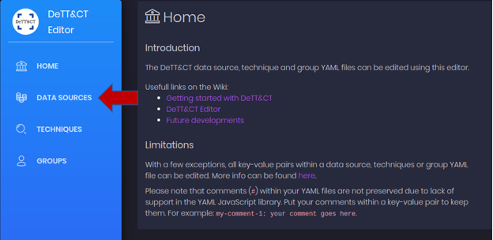

Next, click **New file**

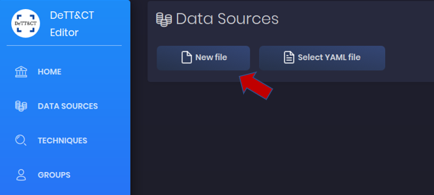

#### Windows

Then click **Add data source**

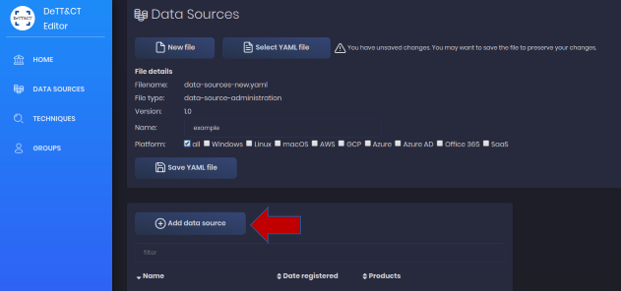

We will start by adding the first data source in the list from LabMeINC.

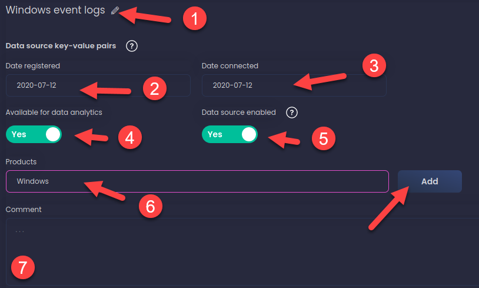

1. Type **Windows event logs** into the Data source field. Click the **Add** button to the right.
2. Click on **Date registered** and pick today's date.
3. Click on **Date connected** and pick today's date. In normal circumstances, you would select the date you began collecting this data source's logs. 
4. Click **Available for data analytics** This option defaults to `No` but you can change it to `Yes` as LabMeINC is actively monitoring the logs. 
5. Click **Data source enabled** This option defaults to `No` but you can change it to `Yes` as LabMeINC is actively collecting the logs. 
6. Type **Windows** in the **Products** field and then click **Add** - This field provides a way to categorize the data sources you are collecting as certain data sources may have more than one entry depending on the data they provide.
7. The comments field is for internal notes or additional information you would like to include during this exercise. We will not add any notes for this exercise. 

Scroll down to the final section of settings that we can configure for this data source. 

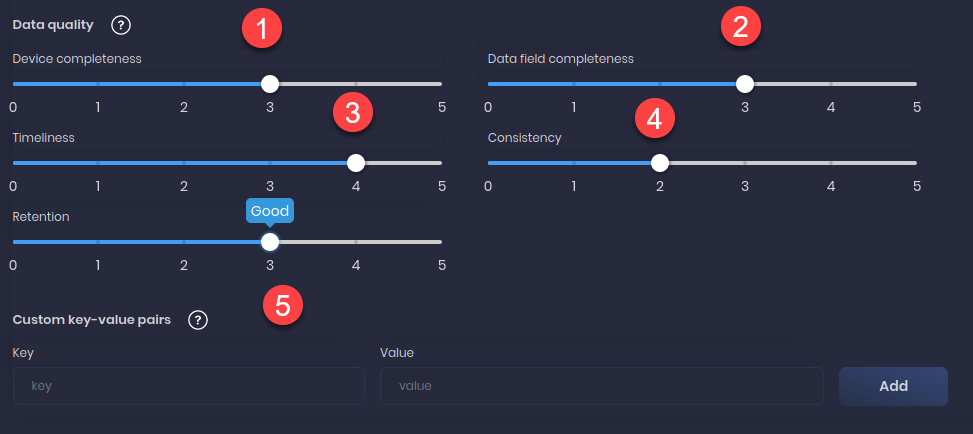

!!! note
    Please note that every organization will vary in the answers to these questions and your answers will vary between each data source.

1. Device Completeness - Are all Windows devices sending their logs to the SIEM?
    * **Set setting to 3**
2. Data Field Completeness - Are all Windows logs fields being parsed?
    * **Set setting to 3**
3. Timeliness - How quickly are the logs received and ingested into the SIEM?
    * **Set setting to 4**
4. Consistency - Are logs ingested on a regular basis or are their large delays or outages?
    * **Set setting to 2**
5. Retention - How long are the logs retained? 
    * **Set setting to 3**

Now that we are finished with configuring the settings for Windows lets proceed to map the next data source.

#### Endpoint Security

Click **Add data source**


Let us proceed to add the Endpoint Security logs. 

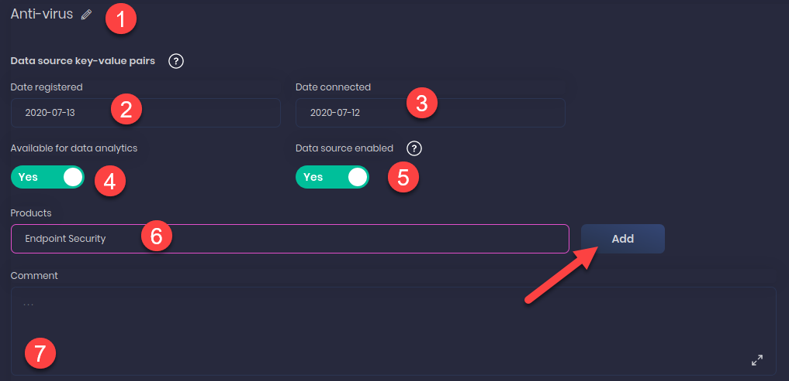

1. Type **Anti-virus** into the Data source field. Click the **Add** button to the right.
2. Click on **Date registered** and pick today's date.
3. Click on **Date connected** and pick today's date. In normal circumstances, you would select the date you began collecting this data source's logs. 
4. Click **Available for data analytics** This option defaults to `No` but you can change it to `Yes` as LabMeINC is actively monitoring the logs. 
5. Click **Data source enabled** This option defaults to `No` but you can change it to `Yes` as LabMeINC is actively collecting the logs. 
6. Type **Endpoint Security** in the **Products** field and then click **Add** - This field provides a way to categorize the data sources you are collecting as certain data sources may have more than one entry depending on the data they provide.
7. The comments field is for internal notes or additional information you would like to include during this exercise. We will not add any notes for this exercise. 

Scroll down to the final section of settings that we can configure for this data source. 

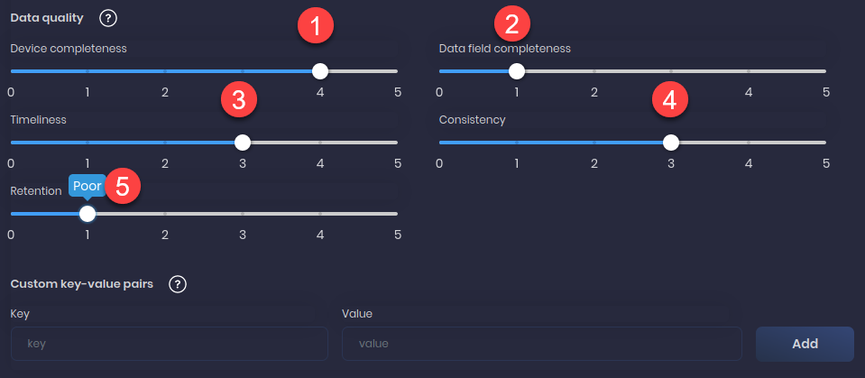

!!! note
    Please note that every organization will vary in the answers to these questions and your answers will vary between each data source.

1. Device Completeness - Are all Windows devices sending their logs to the SIEM?
    * **Set setting to 4**
2. Data Field Completeness - Are all Windows logs fields being parsed?
    * **Set setting to 1**
3. Timeliness - How quickly are the logs received and ingested into the SIEM?
    * **Set setting to 3**
4. Consistency - Are logs ingested on a regular basis or are their large delays or outages?
    * **Set setting to 3**
5. Retention - How long are the logs retained? 
    * **Set setting to 1**

Now that we are finished with configuring the settings for Endpoint Security lets proceed to map the next data source.

#### Linux

Click **Add data source**


Let us proceed to add the Linux logs. 

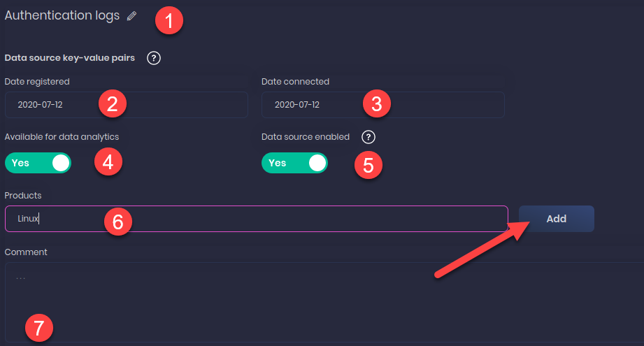

1. Type **Authentication** into the Data source field. Click the **Add** button to the right.
2. Click on **Date registered** and pick today's date.
3. Click on **Date connected** and pick today's date. In normal circumstances, you would select the date you began collecting this data source's logs. 
4. Click **Available for data analytics** This option defaults to `No` but you can change it to `Yes` as LabMeINC is actively monitoring the logs. 
5. Click **Data source enabled** This option defaults to `No` but you can change it to `Yes` as LabMeINC is actively collecting the logs. 
6. Type **Linux** in the **Products** field and then click **Add** - This field provides a way to categorize the data sources you are collecting as certain data sources may have more than one entry depending on the data they provide.
7. The comments field is for internal notes or additional information you would like to include during this exercise. We will not add any notes for this exercise. 

Scroll down to the final section of settings that we can configure for this data source. 


!!! note
    Please note that every organization will vary in the answers to these questions and your answers will vary between each data source.

1. Device Completeness - Are all Windows devices sending their logs to the SIEM?
    * **Set setting to 3**
2. Data Field Completeness - Are all Windows logs fields being parsed?
    * **Set setting to 2**
3. Timeliness - How quickly are the logs received and ingested into the SIEM?
    * **Set setting to 2**
4. Consistency - Are logs ingested on a regular basis or are their large delays or outages?
    * **Set setting to 3**
5. Retention - How long are the logs retained? 
    * **Set setting to 3**

With the Linux logs, they are actually collecting more than just **Authentication Logs** from these systems. We will need to add in the additional logs they are collecting from this data source. 

Click **Add data source**


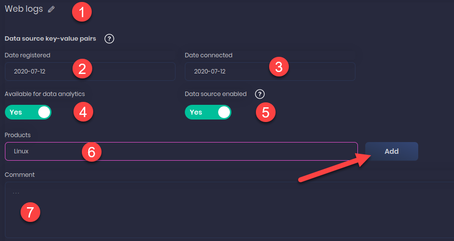

1. Type **Web logs** into the Data source field. Click the **Add** button to the right.
2. Click on **Date registered** and pick today's date.
3. Click on **Date connected** and pick today's date. In normal circumstances, you would select the date you began collecting this data source's logs. 
4. Click **Available for data analytics** This option defaults to `No` but you can change it to `Yes` as LabMeINC is actively monitoring the logs. 
5. Click **Data source enabled** This option defaults to `No` but you can change it to `Yes` as LabMeINC is actively collecting the logs. 
6. Type **Linux** in the **Products** field and then click **Add** - This field provides a way to categorize the data sources you are collecting as certain data sources may have more than one entry depending on the data they provide.
7. The comments field is for internal notes or additional information you would like to include during this exercise. We will not add any notes for this exercise. 

Scroll down to the final section of settings that we can configure for this data source. 


!!! note
    Please note that every organization will vary in the answers to these questions and your answers will vary between each data source.

1. Device Completeness - Are all Windows devices sending their logs to the SIEM?
    * **Set setting to 3**
2. Data Field Completeness - Are all Windows logs fields being parsed?
    * **Set setting to 2**
3. Timeliness - How quickly are the logs received and ingested into the SIEM?
    * **Set setting to 2**
4. Consistency - Are logs ingested on a regular basis or are their large delays or outages?
    * **Set setting to 3**
5. Retention - How long are the logs retained? 
    * **Set setting to 3**

Now that we are finished with configuring the settings for Linux lets proceed to map the next data source.

#### Network Devices

Click **Add data source**


Let's proceed to add the Network Device logs. 

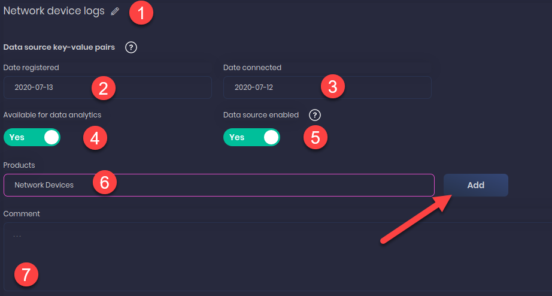

1. Type **Network device logs** into the Data source field. Click the **Add** button to the right.
2. Click on **Date registered** and pick today's date.
3. Click on **Date connected** and pick today's date. In normal circumstances, you would select the date you began collecting this data source's logs. 
4. Click **Available for data analytics** This option defaults to `No` but you can change it to `Yes` as LabMeINC is actively monitoring the logs. 
5. Click **Data source enabled** This option defaults to `No` but you can change it to `Yes` as LabMeINC is actively collecting the logs. 
6. Type **Network Devices** in the **Products** field and then click **Add** - This field provides a way to categorize the data sources you are collecting as certain data sources may have more than one entry depending on the data they provide.
7. The comments field is for internal notes or additional information you would like to include during this exercise. We will not add any notes for this exercise. 

Scroll down to the final section of settings that we can configure for this data source. 

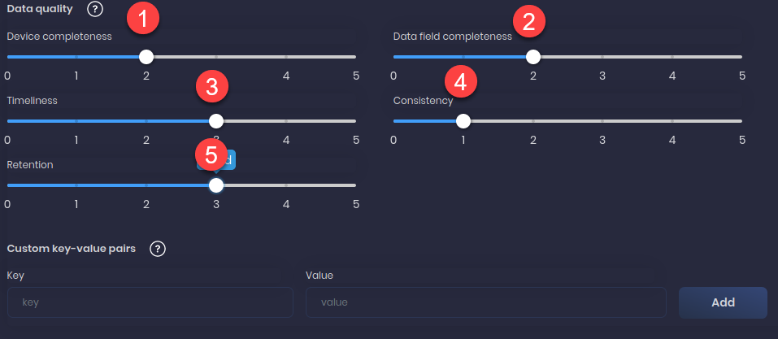

!!! note
    Please note that every organization will vary in the answers to these questions and your answers will vary between each data source.

1. Device Completeness - Are all Windows devices sending their logs to the SIEM?
    * **Set setting to 2**
2. Data Field Completeness - Are all Windows logs fields being parsed?
    * **Set setting to 2**
3. Timeliness - How quickly are the logs received and ingested into the SIEM?
    * **Set setting to 3**
4. Consistency - Are logs ingested on a regular basis or are their large delays or outages?
    * **Set setting to 1**
5. Retention - How long are the logs retained? 
    * **Set setting to 3**

We now have added all of the data sources for LabMeINC and now it is time to save the file and let DeTTECT do its magic. 

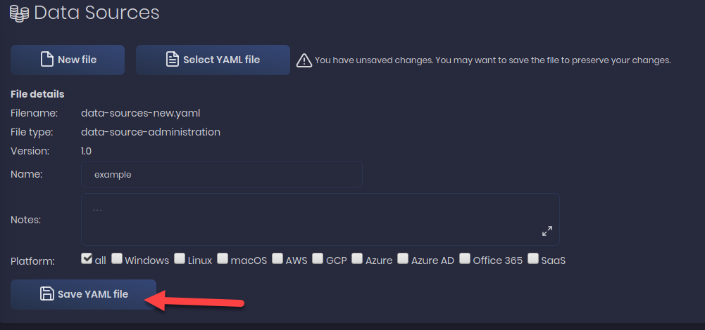

Click **Save YAML file** 

#### Convert YAML file to .JSON

With the YAML file now saved it is time to utilize DeTTECT to convert the YAML file to .JSON.

Go back to your terminal window and press **Enter**. You should see the following command prompt. 

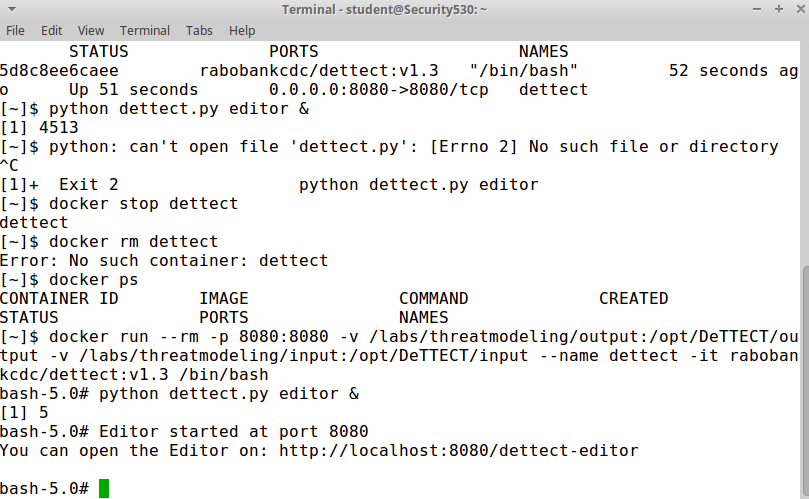

**Copy** and **Paste** the following command into the Terminal Windows and press **Enter**

```bash
python /opt/DeTTECT/dettect.py ds -fd /opt/DeTTECT/input/data-sources-new.yaml -l
```

!!! warning
    By default, DeTTECT will save the file to your Downloads folder on the Student VM. If you move this file or if you fail to save it the above command will not work. Please verify that the file does exist prior to running the command. 
    
Once the script runs successfully there should now be a file in **/home/student/Downloads** called **data_source_example.json** 

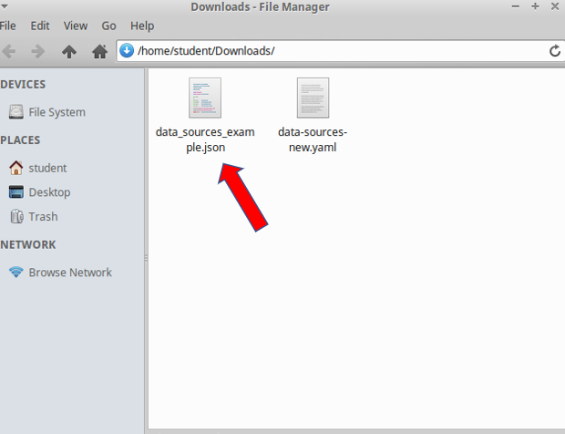

### Visualize Data Sources to the MITRE Framework 

Now that we have utilized DeTTECT to create the **data_source_example.json** file we are ready to map these data sources against the MITRE Framework to determine what visibility LabMeINC actually has. We will be utilizing the MITRE ATT&CK Navigator to visualize the **data_source_example.json** file.

To begin **click** the link below to open MITRE ATT&CK Navigator.

<a href="https://mitre-attack.github.io/attack-navigator/enterprise/" target="_blank">MITRE ATT&CK Navigator</a>

Next, click on the **+** sign next to the layer tab.


Next, click on **Open Existing Layer**.


Now, click on **Upload from Local**.


Then navigate to /home/student/Downloads/ **data_source_example.json** file.

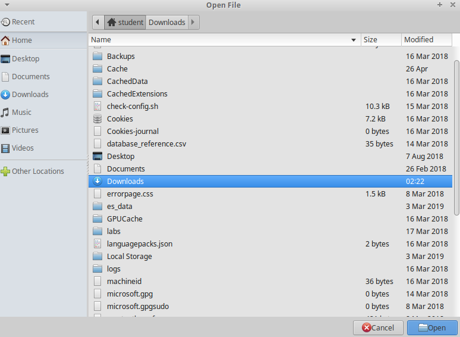

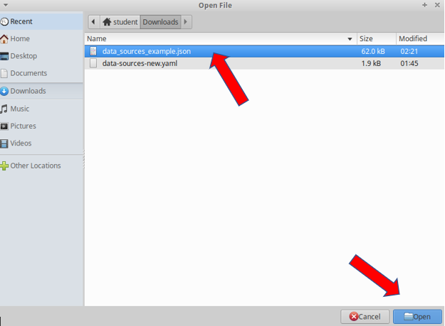

You may receive a warning message about the **layer version**. Just click **OK**


The file will still load successfully. 

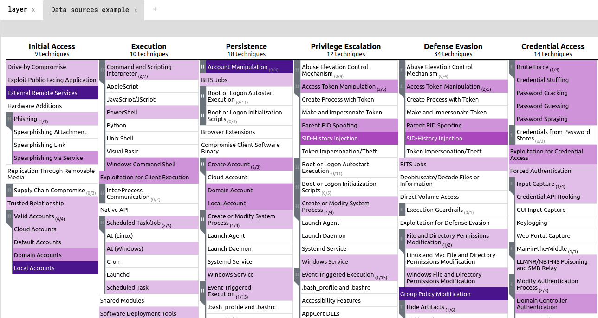

The result will be MITRE Navigator showing a map of the visibility LabMeINC's data sources provide against the MITRE framework. This is very beneficial as we can clearly see techniques that LabMeINC is vulnerable to. The next step would be to evaluate LabMeINC and determine what are the most common attack vectors used against them as they are a Health Organization. This would narrow down which techniques we would recommend they gain additional visibility and detection capabilities. 

Just like LabMeINC, many organizations have similar visibility and often feel stuck due to limited resources and staff. Over the course of this class, we will be walking through many detection techniques that with minimal effort will allow you to level up your visibility and detection even with these minimal data sources. To give you a sneak peek at what this will look like we have created a second .JSON file that includes these additional techniques which will be covered in the class. Let us compare this against the file we generated for LabMeINC.

Click on the **+** sign next to the layer tab.


Next, click on **Open Existing Layer**.


Now, click on **Upload from Local**.


Then navigate to /labs/dettect and open **data_sources_leveled_up.json** file.

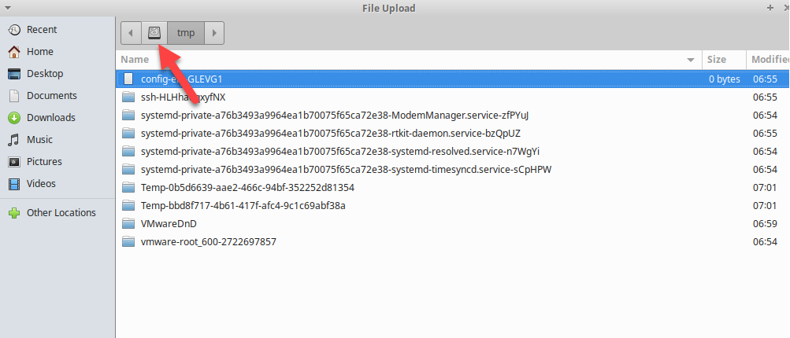


You may receive a warning message about the **layer version**. Just click **OK**


The file will still load successfully. 

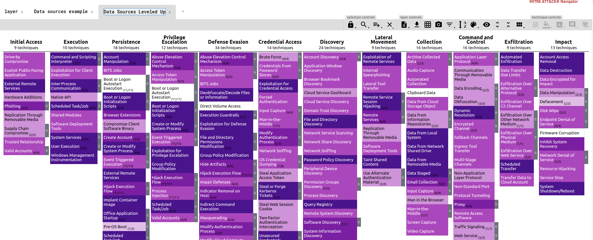

Compare the two tabs now. You can easily see that by strategically adding in key data sources and detection capabilities LabMEINC would be able to level up their overall security. Now would be a great time to begin to map out your organization's visibility and detection capabilities. How do you stack up against LabMeINC?

## Lab Conclusion

In this lab, you reviewed the functionality of the DeTTECT tool and used it to map out data source visibility and detection capabilities. From that exercise, you were able to visualize the data source against the MITRE Framework to evaluate LabMeINC's current capability to see and detect evil within their environment. 

**DeTTECT Lab is now complete**\!
