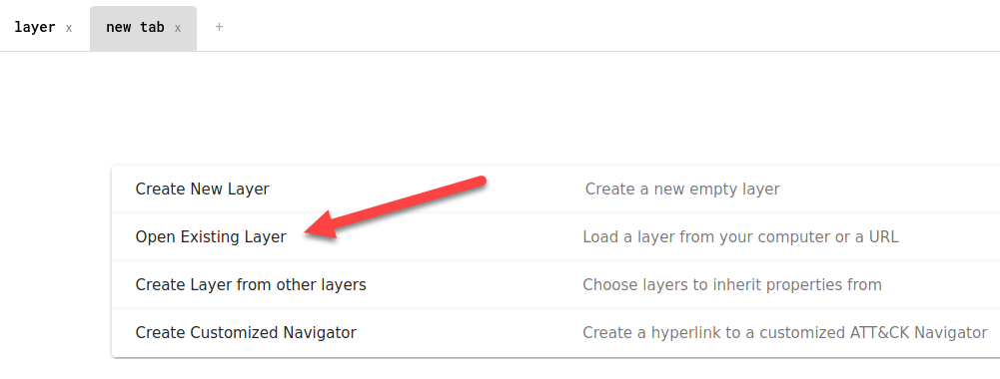
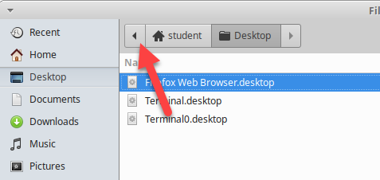
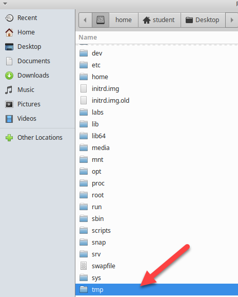
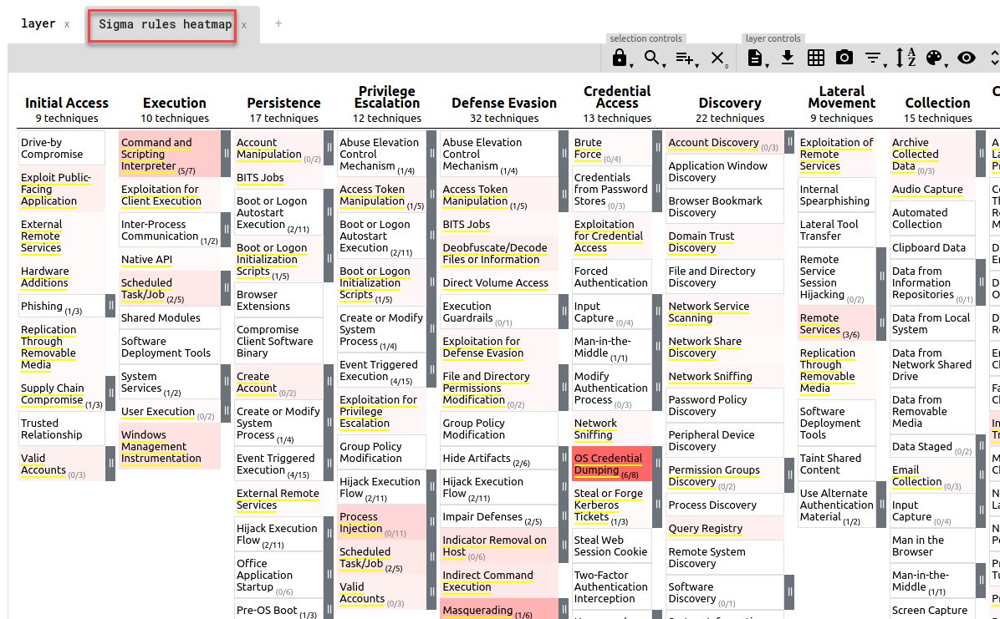

# Lab 1.1 - SIGMA Rules - Leadership

## Objectives

- Learn how to map out your visibility in your environment

- Review logging capabilities and visibility

- Evaluate visibility against the MITRE Attack framework

- Review alert capabilities based on your SIGMA rules

## Exercise Preparation

Log into the Sec-555 VM

- Username: student

- Password: sec555


## Exercises

If you have internet access you can import the heatmap into MITRE ATT&CK Navigator to see your rule coverage. Try doing so by browsing to the link below.

<a href="https://mitre-attack.github.io/attack-navigator/enterprise/" target="_blank">MITRE ATT&CK Navigator</a>

Next, click on the **+** sign next to the Layer tab.


Next, click on **Open Existing Layer**.



Now, click on **Upload from Local**.


Then navigate to /tmp and select heatmap.json.







If you get the warning shown below, click on Okay.


The result will be MITRE Navigator showing a map of the converted Sigma rule coverage. Now, you can monitor your organization's rule to MITRE technique mappings over time.



If you browse to the output folder that you specified when setting up DeTT&ct, you will now have a .json file that we can use to visualize the Windows data source against the MITRE Attack framework. Browse to the following URL with this file. 

`https://mitre-attack.github.io/attack-navigator/enterprise/`

At this site you can `click the plus sign` at the top of the website to add a new layer. Then `click Open Existing Layer`. This will give you the option to Upload from a local file. You will need to browse to the location of the .json file you created and select it and click open. 


When you open this file it will now take the data source information that you provided for the data source and map it to the MITRE Attack framework. So for our example we have followed these steps and here is what we see. 


As you can see the darker the purple the more visibility we have for detecting the specific attack. 

### Review logging capabilities and visibility

Windows Event logs are a common data source most organizations have. While they do provide visibility it begs the question if there is more that can be done to increase the detection capabilities. 
 
System Monitor (Sysmon) is a Windows system service and device driver that, once installed on a system, remains resident across system reboots to monitor and log system activity to the Windows event log. Below is an updated DeTTect data source list now that we have Sysmon running on our Windows systems. 


As you can see Sysmon gives us eight additional data sources. When we began to add in the additional data sources, we leveraged the Products field to differentiate where we were gainng the visibility. Let us compare the difference now. 

Here is our initial Windows Event logs.


Now here is Windows Event logs with the additional Sysmon data sources. 


Clearly, adding in the Sysmon data sources for our Windows logs add a major jump in visibility. This simple process is a great way to show the value of making changes to the logging levels or capabilities of the data sources. When walking through this exercise it would be a great time to evaluate the logging capabilities of each data source to see if there were opportunities to gain additional visibility in the logs that you are collecting. 


### Review alert capabilities based on your rules

The final step is to evaluate the alert rules in place for your data sources. To often organizations will excel in having the needed visibility to detect threats but do not have the appropriate rules to actually alert when a threat is present. Thankfully, we can leverage a tool called `Sigmac` to create heatmap of our rules mapped to the Mitre Attack framework. 

Open a terminal window in the student VM and run the following commands to generate the heatmap. 

```yaml
cd /lab/sigma/elastalert

sudo bash convert.sh
```

The script ran through all of the Sigma rules provided by Sigmac and converted them to ElastAlert rules. It then takes the rules and tests them before putting them into a Production Rules folder. The final step of the script creates a heatmap of the rules against the Mitre Attach framework. 

You should now have a heatmap.json file located in `/lab/sigma/elastalert`. You can now take this file and open it in the Att&ck Navigator that we have been using to show our data source visibility. Below is the alert coverage the SIGMAC tool provided us based on the SIGMA rules we had. 


This is very helpful when trying to evaluate what alert rules you have in place and you can quickly flip back and forth between your data source visibility layers to determine if you have the data to be able to create detection rules agianst. 

In the end these exercises will take some effort to complete in your own environment but it is one of the best ways to map your actual detection capbailities against a security framework. It also provides a road map for you to show gaps in your armor and provide justification for changes in logging and visibility. 

## Lab Conclusion

In the lab you were able to learn how to map out your data source visibility to the Mitre Attack framework. From this you were able to see the value in evaluating the logging capabilities of your data sources to see if they could be enhanced similar to the Windows logs with Sysmon. Finally, you were able to create a heatmap of your alert rules to determine where you lacked alerting or needed additional visibility to detect the evil. 

**Lab 1.1 is now complete**\!
